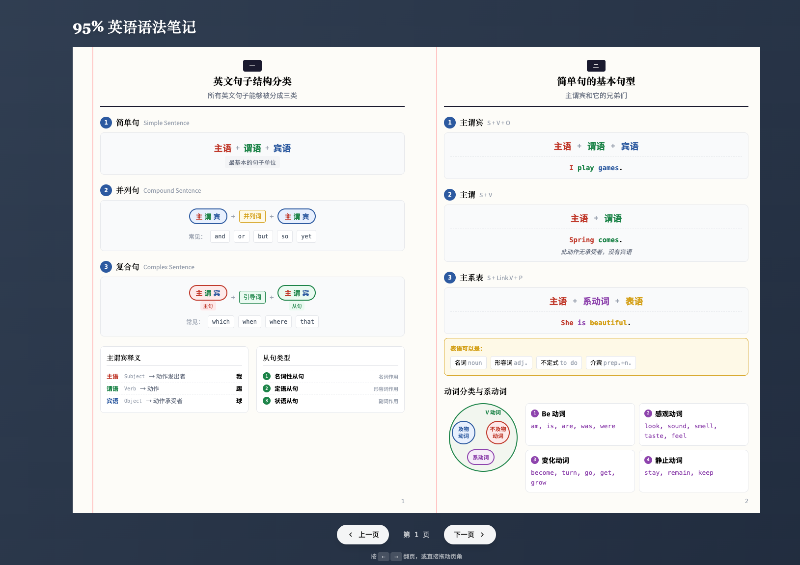

<div align="center">

# 📖 95% 英语语法笔记

[](https://github.com/chihyungchang/95PercentEnglishGrammar)
[](https://react.dev/)
[](https://vitejs.dev/)
[](https://tailwindcss.com/)
[](LICENSE)

**一本可以翻页的交互式英语语法电子书，涵盖 95% 常用英语语法知识**

[📂 GitHub](https://github.com/chihyungchang/95PercentEnglishGrammar) · [🐛 报告问题](https://github.com/chihyungchang/95PercentEnglishGrammar/issues) · [💡 功能建议](https://github.com/chihyungchang/95PercentEnglishGrammar/issues)

</div>

---

## 📸 预览



## ✨ 特点

| 特性 | 描述 |
|:---:|:---|
| 📚 | **翻书效果** - 使用 react-pageflip 实现逼真的翻页动画 |
| 📝 | **笔记本风格** - 模拟横线笔记本的视觉设计 |
| 🔗 | **交互式目录** - 点击目录可直接跳转到对应章节 |
| ⌨️ | **键盘支持** - 使用 ← → 方向键翻页 |
| 📱 | **响应式设计** - 适配不同屏幕尺寸 |

## 📑 内容结构

```
📖 目录
├── 一、英文句子结构分类 ─ 简单句 · 并列句 · 复合句
├── 二、简单句的基本句型 ─ 主谓宾 · 主谓 · 主系表
├── 三、简单句的更多句型 ─ 主谓宾宾 · 主谓宾补 · There be
├── 四、从句详解
│   ├── 名词性从句概述
│   ├── 降级原理 · 主语从句 · 宾语从句
│   └── 表语从句 · 同位语从句
├── 五、定语从句 ─ 定语概念 · 类型 · 位置 · 不定式短语
├── 六、状语从句
│   ├── 状语概念 · 八种分类
│   ├── 时间/地点/原因状语从句
│   └── 条件/目的/结果/让步/方式状语从句
├── 七、三个特殊句式 ─ 强调句 · 倒装句 · 虚拟语气
├── 八、时态
│   ├── 一般时态 · 进行时态
│   ├── 完成时态
│   └── 完成进行时态
├── 九、语态 ─ 主动语态 · 被动语态
└── 十、非谓语 ─ 现在分词 · 过去分词
```

## 🛠️ 技术栈

<table>
<tr>
<td align="center" width="96">

<br>React
</td>
<td align="center" width="96">

<br>Vite
</td>
<td align="center" width="96">

<br>Tailwind
</td>
</tr>
</table>

## 🚀 快速开始

```bash
# 📦 安装依赖
npm install

# 🔥 启动开发服务器
npm run dev

# 📦 构建生产版本
npm run build

# 👀 预览生产版本
npm run preview
```

## 🎨 颜色规范

| 颜色 | 用途 | 色值 | 预览 |
|:---|:---|:---|:---:|
| 🔴 红色 | 主语 (Subject) | `#c0392b` |  |
| 🟢 绿色 | 谓语 (Verb) | `#1e8449` |  |
| 🔵 蓝色 | 宾语 (Object) | `#2d5aa0` |  |
| 🟣 紫色 | 系动词 (Linking Verb) | `#8e44ad` |  |
| 🟡 黄色 | 表语/高亮 | `#d4a017` |  |

## 🎮 操作说明

| 操作 | 方式 |
|:---|:---|
| 📖 翻页 | 点击页角拖动，或使用 `←` `→` 方向键 |
| 🔗 跳转 | 在目录页点击章节标题 |
| 🧭 导航 | 使用底部的「上一页」「下一页」按钮 |

## 📁 项目结构

```
src/
├── 📄 main.jsx              # 应用入口
├── 📄 App.jsx               # 主组件
├── 📁 components/
│   └── 📁 pages/            # 页面组件
│       ├── CoverPage.jsx        # 📕 封面
│       ├── TableOfContents.jsx  # 📑 目录
│       ├── Page1-20.jsx         # 📄 内容页
│       └── BackCover.jsx        # 📗 封底
└── 📁 styles/
    └── index.css            # 🎨 全局样式
```

## 📚 笔记来源

[](https://www.youtube.com/watch?v=yDZqQ2wNRxA)

https://www.youtube.com/watch?v=yDZqQ2wNRxA

## 📄 许可证

本项目采用 [GPL-3.0](LICENSE) 许可证。

这意味着：
- ✅ 可以自由使用、修改、分发
- ✅ 必须保留版权声明
- ⚠️ 衍生作品必须同样开源
- ❌ 不能闭源发布

---

<div align="center">

**用心制作，希望对你的英语学习有所帮助！** 💪

如果这个项目对你有帮助，欢迎 ⭐ Star 支持一下~

</div>
